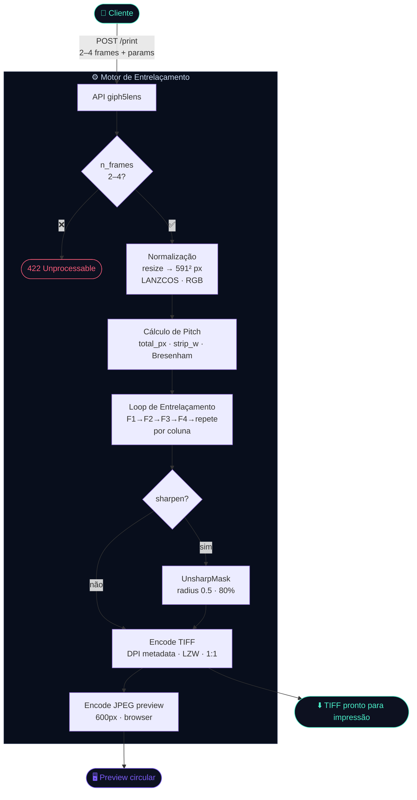
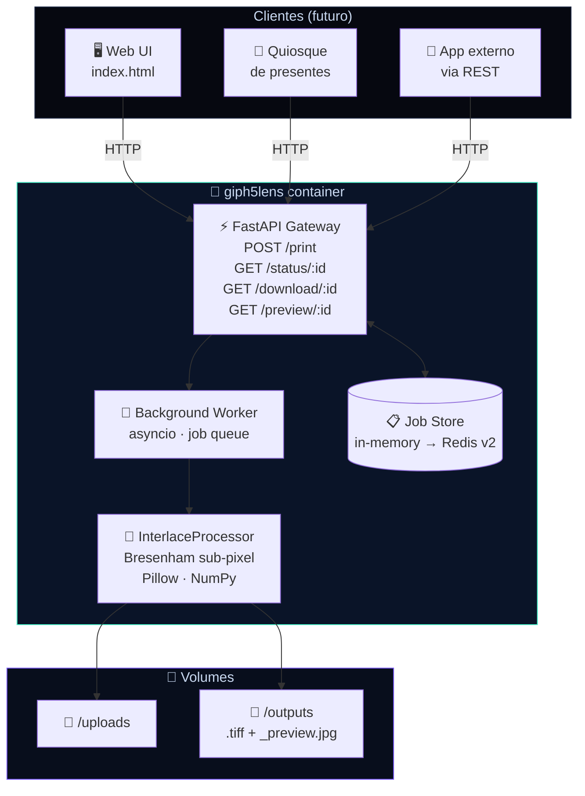
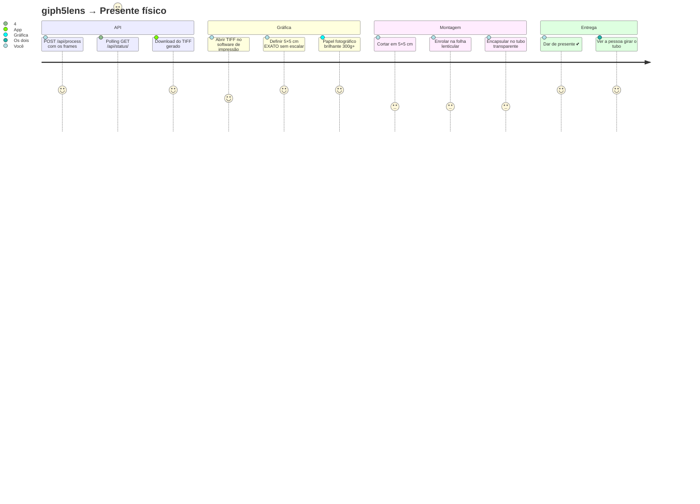
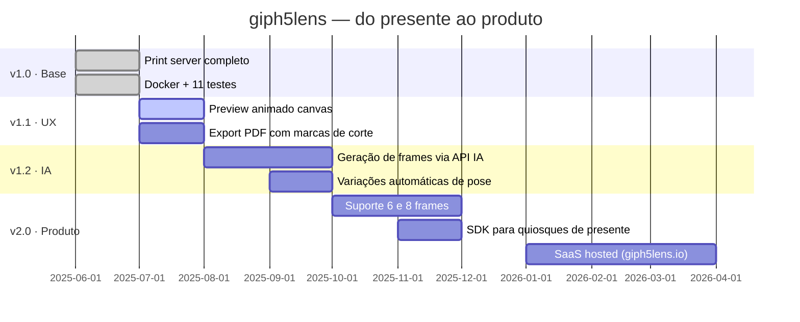

<p align="center">
  <br/>
  
  <br/><br/>
  
  
  
  
  
  <br/><br/>
</p>

> **giph5lens** é um Print Server especializado para microtubo lenticular.  
> Você envia frames. A API entrega um arquivo TIFF pronto para impressão — matematicamente perfeito para as lentes de 100 LPI.  
> Nada de Photoshop, nada de cálculo manual. Só o movimento.

---

## 💡 A Diferença

A Polaroid captura um instante e entrega papel.  
A **giph5lens** captura um instante e entrega **movimento**.

| Atributo | Polaroid Tradicional | giph5lens Printer |
|---|---|---|
| Formato | Plano e estático | Cilíndrico · Microtubo 5×5 cm |
| Efeito | Foto que aparece | "Holograma" sutil e romântico |
| Tecnologia | Química de revelação | Entrelaçamento digital sub-pixel |
| Interação | Ver a foto | **Girar o tubo para ver o movimento** |
| Complexidade | Zero | Zero — a API resolve tudo |

> Nasceu como presente de Dia dos Namorados.  
> Cresceu e virou um microserviço de impressão especializado.

---

## 🧮 O Motor: Matemática do Entrelaçamento

Toda a "mágica" parte de duas constantes físicas da folha lenticular:

```
total_px  =  round(size_cm / 2.54 × dpi)
           =  round(5 / 2.54 × 300)  →  591 px

strip_w   =  total_px / (lpi × n_frames)
           =  591 / (100 × 4)  →  1.4775 px  ← sub-pixel
```

Como `1.4775 px` não é inteiro, o algoritmo usa **distribuição de erro Bresenham**:  
cada tira alterna entre `floor` e `ceil`, garantindo que a soma exata = `591 px`.  
Desalinhar isso em 1 px a 100 LPI = animação quebrada. Por isso isso não é um script, é um servidor.

---

## 🔄 Pipeline Completo



---

## 🌐 Arquitetura como Microserviço



---

## 🚀 Quick Start

```bash
git clone https://github.com/SEU_USUARIO/giph5lens.git
cd giph5lens

docker compose up --build
# → http://localhost:8000
```

**API direta (sem UI):**

```bash
curl -X POST http://localhost:8000/api/process \
  -F "files=@foto1.jpg" \
  -F "files=@foto2.jpg" \
  -F "files=@foto3.jpg" \
  -F "files=@foto4.jpg" \
  -F "lpi=100" \
  -F "dpi=300" \
  -F "size_cm=5.0"

# → { "job_id": "a3f2c1b0", "status": "queued", ... }

curl http://localhost:8000/api/download/a3f2c1b0 --output microtubo.tiff
```

**CLI standalone:**

```bash
pip install -r requirements.txt
python -m processing.interlace f1.jpg f2.jpg f3.jpg f4.jpg saida.tiff
# ✓ total_px=591  strip=1.4775px
```

---

## ⚙️ Parâmetros da API

| Parâmetro | Padrão | Range | Descrição |
|-----------|--------|-------|-----------|
| `lpi` | `100` | 60–200 | Linhas/polegada da folha lenticular |
| `dpi` | `300` | 150–600 | Resolução de impressão |
| `size_cm` | `5.0` | 2–20 | Tamanho do microtubo em cm |
| `n_frames` | auto | 2–4 | Detectado pelo nº de arquivos enviados |

> **Sweet spot identificado:** 4 frames entrega animação fluida mesmo que  
> o ideal matemático puro para 300 DPI/100 LPI sejam 3 — a nitidez  
> é compensada via UnsharpMask no servidor.

---

## 🖨️ Da API ao Holograma



---

## 🗂️ Estrutura

```
giph5lens/
│
├── 🐳 Dockerfile
├── 🐳 docker-compose.yml
├── 📦 requirements.txt
│
├── app/
│   ├── main.py               ← FastAPI · rotas · job queue
│   └── templates/
│       └── index.html        ← UI dark holográfica (zero dependências)
│
├── processing/
│   └── interlace.py          ← ⭐ motor: Bresenham sub-pixel + Pillow/NumPy
│
└── tests/
    └── test_interlace.py     ← 11 testes · 0 falhas
```

---

## 🧪 Testes

```bash
pytest tests/ -v
# 11 passed in 0.27s ✅
```

| Teste | Garante |
|-------|---------|
| `test_total_px_5cm_300dpi` | 5 cm @ 300 DPI = 591 px exatos |
| `test_recalc_strip_4_frames` | strip = 1.4775 px |
| `test_output_shape` | TIFF tem dimensões corretas |
| `test_output_has_dpi_metadata` | Metadado DPI preservado para impressão 1:1 |
| `test_total_columns_match` | Soma Bresenham = total\_px sem off-by-one |
| `test_interlacing_alternates_frames` | Frames realmente se intercalam |
| `test_preview_created` | JPEG preview ≤ 600 px gerado |
| `test_rejects_single_frame` | < 2 frames → ValueError |

---

## 🗺️ Roadmap



**A visão de longo prazo:** um endpoint público onde qualquer app de presente envia fotos e recebe de volta um TIFF pronto — a inteligência por trás de quiosques físicos, e-commerces de presentes personalizados e máquinas vending de microtubo.

---

## 🤝 Contribuindo

PRs bem-vindos. Áreas prioritárias:

- Algoritmo para LPI não-standard (75, 150, 200)
- Suporte a parallax (frames com perspectivas levemente diferentes)
- Modo `--dry-run` que retorna só os cálculos sem processar
- Testes de ponta a ponta com impressão real

```bash
git checkout -b feat/minha-contribuicao
# faça as mudanças
pytest tests/ -v          # todos devem passar
git commit -m "feat: descrição"
git push origin feat/minha-contribuicao
```

---

<p align="center">
  <sub><b>giph5lens</b> — a Polaroid que entrega movimento</sub><br/>
  <sub>Nasceu de um presente · cresceu virou um microserviço · quer virar um produto</sub><br/><br/>
  <sub>Feito com ♥ e muito <code>numpy</code></sub>
</p>