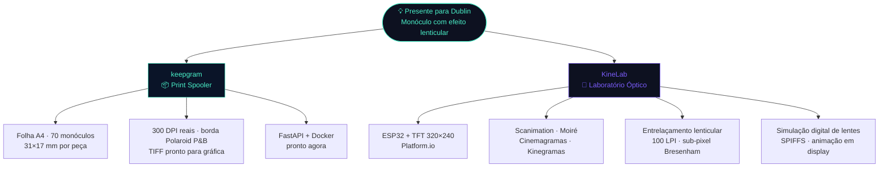
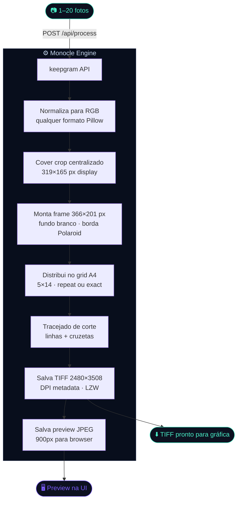
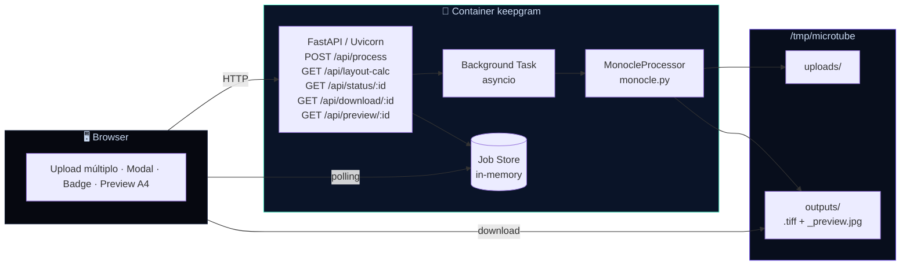
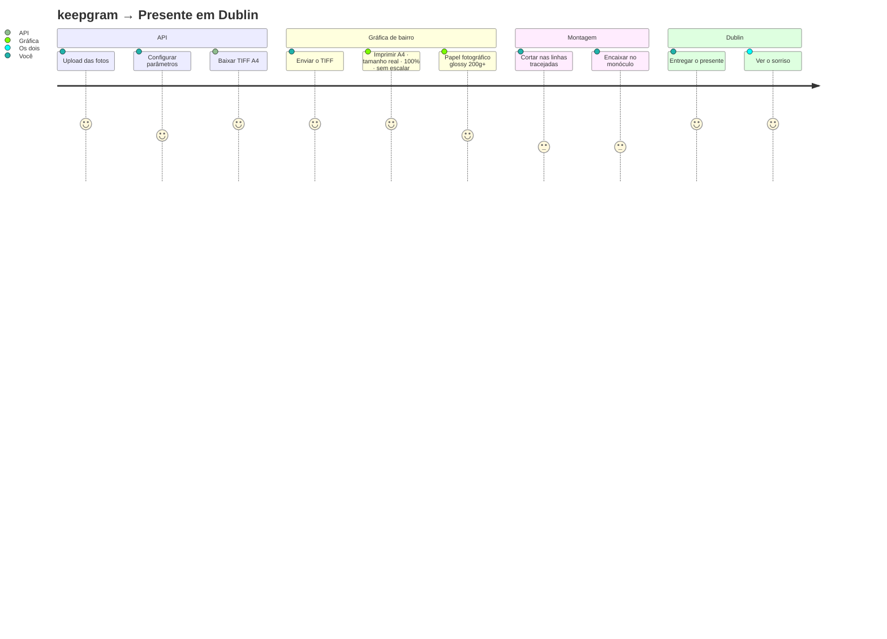
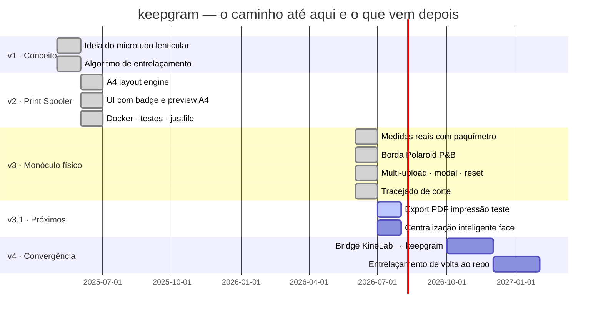

<p align="center">
  
  <br/><br/>
  
  
  
  
  
  
</p>

<h1 align="center">Quando o Código Vira Lembrança</h1>

<p align="center">
  <i>Como um presente de Dia dos Namorados virou um Print Spooler, dois repositórios e um laboratório de óptica em miniatura.</i>
</p>

---

## 👋 Contexto

Sou estudante de Sistemas Web no último semestre da faculdade em Santa Catarina.
Nas horas vagas: entusiasta de cultura maker, eletrônica, impressão 3D e de qualquer projeto que consiga transformar uma ideia em algo físico que você pode segurar na mão.

Esse projeto não nasceu de uma disciplina, de um hackathon ou de uma demanda de trabalho.

Nasceu de um problema muito pessoal.

Minha noiva mora em Dublin. O Valentine's Day estava chegando. Eu queria mandar um presente que fosse mais do que uma caixinha comprada online — queria mandar algo que eu tivesse construído, do zero, com as ferramentas que tenho.

A ideia era resgatar o espírito dos antigos monóculos fotográficos — aqueles pequenos cilindros de plástico dos anos 70 e 90 onde você apontava para a luz e via uma fotografia ampliada por uma lente — mas adicionar movimento. Uma animação óptica sutil, o tipo de coisa que parece um pouco com magia quando você gira o tubo entre os dedos.

O resultado foi um projeto que ficou maior do que o planejado, teve a rota recalculada no meio do caminho e acabou se dividindo em dois repositórios com missões completamente diferentes.

Este aqui é o **keepgram**.

---

## 📸 O que é um monóculo fotográfico?

Se você já abriu uma caixa de fotos antigas dos seus pais ou avós, provavelmente encontrou um.

<p align="center">
  <i>Um pequeno cilindro. Uma lente numa ponta. Uma fotografia minúscula na outra. Você apontava para a luz e a memória aparecia ampliada na frente dos seus olhos.</i>
</p>

O monóculo fotográfico foi popular entre as décadas de 70 e 90 e representava uma época em que as memórias eram físicas. Não existia nuvem, galeria infinita no celular ou backup automático. Existia uma fotografia revelada, guardada com cuidado.

O keepgram começou como uma tentativa de resgatar exatamente esse sentimento, usando as ferramentas que temos hoje.

---

## 💡 A ideia original

A versão inicial do projeto era ambiciosa: criar um microtubo fotográfico com **efeito lenticular** — aquela técnica em que diferentes imagens aparecem dependendo do ângulo de visão, criando uma animação sutil quando você gira o objeto.

Para funcionar, a foto precisava ser **entrelaçada matematicamente** para casar com as micro-lentes da folha lenticular (100 LPI). Um algoritmo de fatiamento vertical distribuiria pixels de 4 frames diferentes em tiras de aproximadamente 1,5 px cada, com precisão sub-pixel estilo Bresenham.

Era a parte técnica mais interessante. E também a que precisou ser pausada.

---

## 🛑 A vida real bateu na porta

Entre provas do último semestre, estágio, o prazo da entrega internacional e o preço do papel lenticular (caro, raro e cada teste físico custando dinheiro), precisei fazer o que todo desenvolvedor faz quando os requisitos mudam:

**Recalcular a rota.**

```
Problema: papel lenticular é caro, raro e exige calibração técnica por foto
Prazo:    Valentine's Day · entrega em Dublin · junho · imóvel
Decisão:  dividir o projeto em dois repositórios com missões distintas
```

---

## 🔀 Como o projeto se dividiu



| | keepgram | KineLab |
|---|---|---|
| **Missão** | Entregar o presente agora | Explorar sem pressão de prazo |
| **Foco** | Impressão fotográfica precisa | Óptica · ESP32 · animação |
| **Status** | ✅ produção | 🔬 laboratório |
| **Stack** | Python · FastAPI · Pillow · Docker | C++ · Platform.io · TFT · SPIFFS |

---

## 🎯 O que o keepgram faz hoje

> **Fotos entram. Uma folha A4 sai — com até 70 monóculos 31×17 mm, 300 DPI reais, borda estilo Polaroid, tracejado de corte e pronta para qualquer gráfica de bairro.**

O problema que ele resolve parece pequeno mas é mais crítico do que parece: quando você trabalha com elementos ópticos e monóculos, um redimensionamento automático de apenas 1 mm por parte do driver da impressora já compromete o encaixe físico. O keepgram funciona como um **Print Spooler especializado** — embute os metadados de DPI no TIFF de saída e orienta o usuário para imprimir em tamanho real, sem escalonamento.

---

## ✨ O que tem dentro (v3)

- Upload de **1 a 20 fotos** de uma vez — qualquer formato que o Pillow abrir
- **Borda estilo Polaroid P&B** — moldura branca + linha preta ao redor da janela da foto, fiel ao rebaixo físico do monóculo
- **Modal de decisão** — se você envia menos fotos que o total de células, o keepgram pergunta: repetir para preencher ou colocar só as suas?
- **Tracejado de corte** — linhas tracejadas cinza no gap entre cada monóculo + cruzetas nos cantos para guiar a tesoura
- **Botão Limpar** — reseta tudo sem recarregar a página
- **Aviso de crop** — aparece só depois do upload, nunca antes
- Export **PNG lossless** ou **TIFF** com metadados de resolução

---

## 📐 Especificação física do monóculo (medidas reais — paquímetro)

```
Frame externo (papel cortado):
  Largura total  = 31.0 mm  →  366 px @ 300 DPI
  Altura total   = 17.0 mm  →  201 px @ 300 DPI

Display interno (janela óptica — rebaixo da cápsula):
  Largura display = 27.0 mm  →  319 px @ 300 DPI
  Altura display  = 14.0 mm  →  165 px @ 300 DPI

Borda Polaroid (diferença frame − display):
  Lateral = (31 − 27) / 2 = 2.0 mm → 24 px cada lado
  Vertical = (17 − 14) / 2 = 1.5 mm → 18 px cada lado

Bleed mínimo  : 0.3 mm  (rebaixo físico é apertado)
Border radius : 1.0 mm  →  12 px
```

---

## 🧮 A matemática do grid A4

```
A4 = 210 × 297 mm
margem externa = 8 mm  (sangria da gráfica)
gap entre peças = 2 mm  (espaço de corte)

usable_w = 210 − 2×8 = 194 mm
usable_h = 297 − 2×8 = 281 mm

cols = ⌊(194 + 2) / (31 + 2)⌋ = ⌊196 / 33⌋ = 5
rows = ⌊(281 + 2) / (17 + 2)⌋ = ⌊283 / 19⌋ = 14

total = 5 × 14 = 70 monóculos por folha A4  ✅
```

> Comparativo: o formato retangular 31×17 mm aproveita muito melhor o A4 do que o microtubo quadrado 50×50 mm (que dava apenas 15 cópias).

---

## 🔄 Pipeline



---

## 🌐 Arquitetura



---

## 🚀 Quick Start

```bash
git clone https://github.com/pizzirano/keepgram.git
cd keepgram

docker compose up --build
# → abra http://localhost:8000
```

**Sem Docker:**

```bash
pip install -r requirements.txt
uvicorn app.main:app --reload
```

**API direta:**

```bash
# Calcular o grid sem processar nada
curl "http://localhost:8000/api/layout-calc?dpi=300&gap_mm=2&margin_mm=8"
# → {"total_per_a4":70,"cols":5,"rows":14,"outer_px":"366×201","display_px":"319×165",...}

# Processar 1 ou mais fotos — modo A4 repetindo
curl -X POST http://localhost:8000/api/process \
  -F "files=@foto1.jpg" \
  -F "files=@foto2.jpg" \
  -F "mode=a4" \
  -F "fill_mode=repeat" \
  -F "dpi=300" \
  -F "gap_mm=2"
# → {"job_id":"a3f2c1b0","status":"queued",...}

# Baixar
curl http://localhost:8000/api/download/a3f2c1b0 --output keepgram_a4.tiff
```

**CLI standalone:**

```bash
python -m processing.monocle foto.jpg saida.tiff --a4
# → {"total_per_a4":70,"cols":5,"rows":14,...}
```

---

## ⚙️ Parâmetros da API

| Parâmetro | Padrão | Descrição |
|-----------|--------|-----------|
| `files` | — | 1 a 20 imagens (qualquer formato) |
| `mode` | `a4` | `a4` = folha completa · `single` = monóculo único |
| `fill_mode` | `repeat` | `repeat` = repete fotos até 70 · `exact` = só as enviadas |
| `dpi` | `300` | Resolução de impressão |
| `polaroid_border` | `true` | Moldura branca + borda preta estilo Polaroid |
| `round_corners` | `true` | Border-radius de 1 mm nos cantos |
| `draw_cut_lines` | `true` | Tracejado de corte entre monóculos |
| `enhance_transparency` | `false` | +15% contraste, +20% saturação para acetato |
| `export_format` | `PNG` | `PNG` (lossless) ou `TIFF` (máx. fidelidade) |
| `gap_mm` | `2.0` | Espaço entre monóculos |
| `margin_mm` | `8.0` | Margem externa da folha |

---

## 🖨️ Do TIFF ao monóculo



---

## 🧪 Testes

```bash
pytest tests/test_monocle.py -v
# 24 passed ✅
```

| Teste | O que garante |
|-------|--------------|
| `test_outer_w / test_outer_h` | Frame 31mm = 366 px · 17mm = 201 px |
| `test_display_w / test_display_h` | Display 27mm = 319 px · 14mm = 165 px |
| `test_grid_70` | Grid A4 = 5×14 = 70 monóculos |
| `test_polaroid_border_rgb` | Cantos do frame são brancos (borda Polaroid) |
| `test_corners_rgba` | RGBA preservado com cantos arredondados |
| `test_tiff_dpi` | TIFF sai com DPI=300 no metadado |
| `test_portrait_no_distort` | Foto retrato não distorce |
| `test_a4_size` | Canvas A4 = 2480×3508 px |
| `test_a4_total_70` | Resultado confirma 70 cópias |
| `test_multi_photo` | 3 fotos → `photos_uploaded: 3` |
| `test_exact_fill` | `fill_mode=exact` → só 3 células usadas |
| `test_preview` | Preview JPEG ≤ 900 px gerado |

---

## 🗂️ Estrutura do projeto

```
keepgram/
│
├── 🐳 Dockerfile
├── 🐳 docker-compose.yml
├── 📦 requirements.txt
│
├── app/
│   ├── main.py               ← FastAPI v3: multi-upload · job queue · endpoints
│   └── templates/
│       └── index.html        ← UI: thumbs · modal repeat/exact · reset · badge
│
├── processing/
│   ├── monocle.py            ← ⭐ motor: borda Polaroid · grid · tracejado · crop
│   └── interlace.py          ← pausado → exploração continua no KineLab
│
└── tests/
    └── test_monocle.py       ← 24 testes · 0 falhas
```

---

## 🔬 E o KineLab?

Enquanto o keepgram resolve o problema imediato da impressão, o **KineLab** é o espaço onde a pesquisa continua sem prazo e sem pressão.

É lá que estou explorando:

- **ESP32 + displays TFT** via Platform.io
- **Scanimation** — sequências de quadros reveladas por uma máscara móvel
- **Efeito Moiré** — padrões visuais gerados pela sobreposição de grades
- **Grades de barreira** — animações baseadas em ângulo de visão
- **Cinemagramas e Kinegramas** — animação produzida pelo movimento físico de uma nota sobre uma imagem intercalada
- **Simulação digital de lentes lenticulares** — preview sem papel lenticular físico
- **Entrelaçamento sub-pixel** — o algoritmo Bresenham que ficou de fora desta versão

> O presente para Dublin foi apenas o ponto de partida. O laboratório continua aberto.

---

## 🗺️ Roadmap



---

## 🤝 Contribuindo

Esse projeto foi feito por um estudante com um prazo, um paquímetro na mão e muita vontade de aprender. Qualquer contribuição é bem-vinda — especialmente de quem trabalha com impressão, óptica ou eletrônica maker.

```bash
git clone https://github.com/pizzirano/keepgram.git
git checkout -b feat/minha-contribuicao
# faça as mudanças
pytest tests/ -v     # todos devem passar
git commit -m "feat: descrição clara"
git push origin feat/minha-contribuicao
```

---

<p align="center">
  <sub>Sistemas Web · Santa Catarina · último semestre · Maker nas horas vagas</sub><br/>
  <sub>entusiasta de tudo que vira objeto físico que você pode segurar na mão</sub><br/><br/>
  <sub><b>keepgram</b> — quando o código vira lembrança · feito com ♥ e muito <code>Pillow</code> para Dublin</sub>
</p>