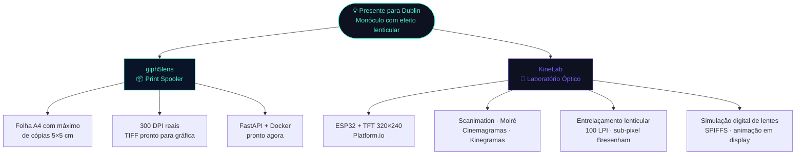
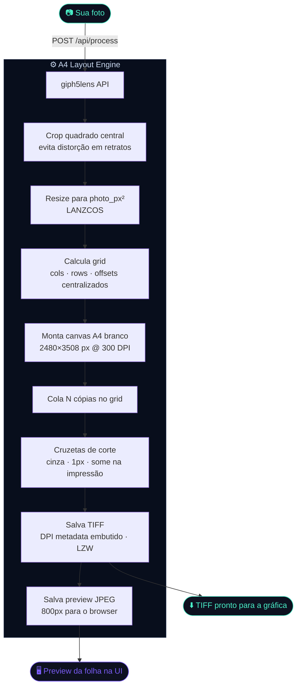
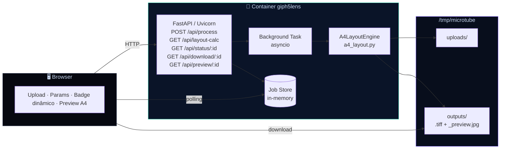
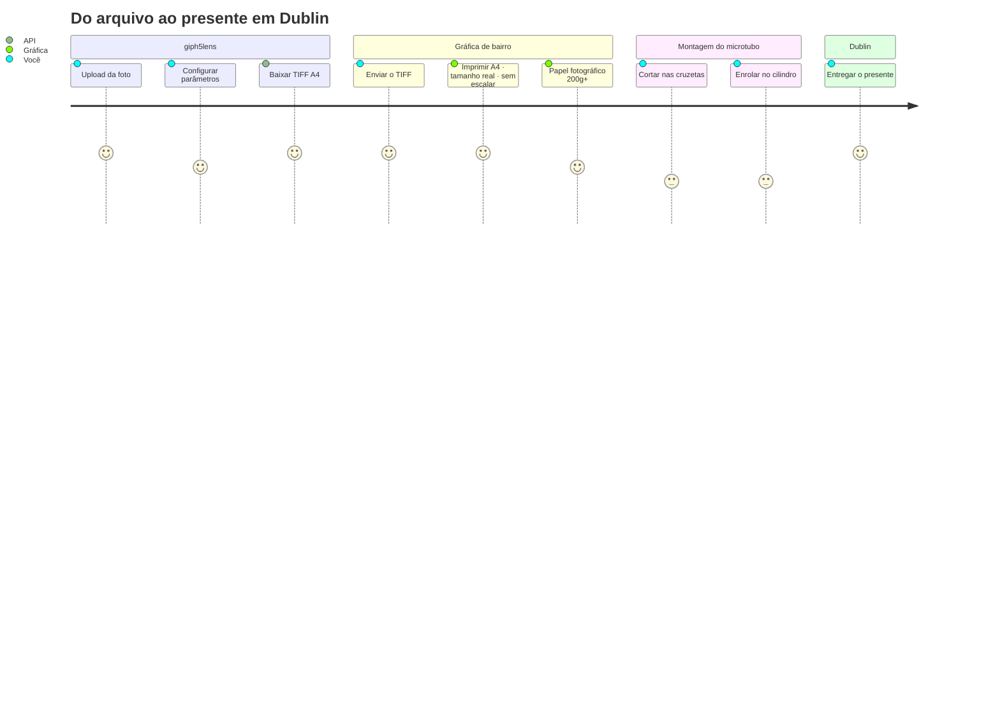
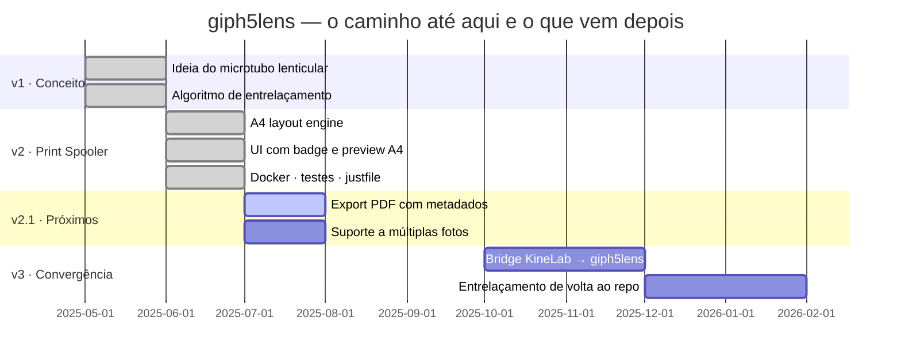

     

# Quando o Código Vira Lembrança

> _Como um presente de Dia dos Namorados virou um Print Spooler, dois repositórios e um laboratório de óptica em miniatura._

---

## 👋 Contexto

Sou estudante de Sistemas Web no último semestre da faculdade em Santa Catarina.
Nas horas vagas: entusiasta de cultura maker, eletrônica, impressão 3D e de qualquer projeto que consiga transformar uma ideia em algo físico que você pode segurar na mão.

Esse projeto não nasceu de uma disciplina, de um hackathon ou de uma demanda de trabalho.

Nasceu de um problema muito pessoal.

Minha noiva mora em Dublin. O Valentine's Day estava chegando. Eu queria mandar um presente que fosse mais do que uma caixinha comprada online — queria mandar algo que eu tivesse construído, do zero, com as ferramentas que tenho.

A ideia era resgatar o espírito dos antigos monóculos fotográficos — aqueles pequenos cilindros de plástico dos anos 70 e 90 onde você apontava para a luz e via uma fotografia ampliada por uma lente — mas adicionar movimento. Uma animação óptica sutil, o tipo de coisa que parece um pouco com magia quando você gira o tubo entre os dedos.

O resultado foi um projeto que ficou maior do que o planejado, teve a rota recalculada no meio do caminho e acabou se dividindo em dois repositórios com missões completamente diferentes.

Este aqui é o giph5lens.

---

## 📸 O que é um monóculo fotográfico?

Se você já abriu uma caixa de fotos antigas dos seus pais ou avós, provavelmente encontrou um.

<p align="center">
  <i>Um pequeno cilindro. Uma lente numa ponta. Uma fotografia minúscula na outra. Você apontava para a luz e a memória aparecia ampliada na frente dos seus olhos.</i>
</p>

O monóculo fotográfico foi popular entre as décadas de 70 e 90 e representava uma época em que as memórias eram físicas. Não existia nuvem, galeria infinita no celular ou backup automático. Existia uma fotografia revelada, guardada com cuidado.

O giph5lens começou como uma tentativa de resgatar exatamente esse sentimento, usando as ferramentas que temos hoje.

---

## 💡 A ideia original

A versão inicial do projeto era ambiciosa: criar um microtubo fotográfico de 5×5 cm com **efeito lenticular** — aquela técnica em que diferentes imagens aparecem dependendo do ângulo de visão, criando uma animação sutil quando você gira o objeto.

Para funcionar, a foto precisava ser **entrelaçada matematicamente** para casar com as micro-lentes da folha lenticular (100 LPI). Um algoritmo de fatiamento vertical distribuiria pixels de 4 frames diferentes em tiras de aproximadamente 1,5 px cada, com precisão sub-pixel estilo Bresenham.

Era a parte técnica mais interessante. E também a que precisou ser pausada.

---

## 🛑 A vida real bateu na porta

Entre provas do último semestre, estágio, o prazo da entrega internacional e o preço do papel lenticular (caro, raro e cada teste físico custando dinheiro), precisei fazer o que todo desenvolvedor faz quando os requisitos mudam:

**Recalcular a rota.**

```
Problema: papel lenticular é caro, raro e exige calibração técnica por foto
Prazo:    Valentine's Day · entrega em Dublin · junho · imóvel
Decisão:  dividir o projeto em dois repositórios com missões distintas
```

---

## 🔀 Como o projeto se dividiu



| | giph5lens | KineLab |
|---|---|---|
| **Missão** | Entregar o presente agora | Explorar sem pressão de prazo |
| **Foco** | Impressão fotográfica precisa | Óptica · ESP32 · animação |
| **Status** | ✅ produção | 🔬 laboratório |
| **Stack** | Python · FastAPI · Pillow · Docker | C++ · Platform.io · TFT · SPIFFS |

---

## 🎯 O que o giph5lens faz hoje

> **Uma foto entra. Uma folha A4 sai — com o máximo de cópias 5×5 cm, 300 DPI reais, guias de corte e pronta para qualquer gráfica de bairro.**

O problema que ele resolve parece pequeno mas é mais crítico do que parece: quando você trabalha com elementos ópticos e microtubos, um redimensionamento automático de apenas 2 mm por parte do driver da impressora já compromete o resultado. O giph5lens funciona como um **Print Spooler especializado** — embute os metadados de DPI no TIFF de saída e orienta o usuário para imprimir em tamanho real, sem escalonamento.

---

## ✨ Novidades (atualização)

- Suporte a múltiplas imagens no upload (frontend aceita `multiple`).
- Opção `Repetir para preencher A4`: se ativada (`repeat`), as imagens selecionadas são ciclicamente repetidas até preencher a folha A4; se desativada, apenas as imagens enviadas serão colocadas e as posições restantes ficarão em branco.
- Botão `Limpar` para resetar o formulário e subir novas imagens do zero.
- Botão `Imprimir/PDF`: abre uma janela com o preview e aciona `window.print()` — útil para gerar um PDF local sem gastar tinta.
- API: o endpoint `/api/process` agora aceita múltiplos arquivos (`file=@a.jpg -F file=@b.jpg`) e recebe o campo `repeat` com valores `repeat` ou `no-repeat`.

Exemplo `curl` para múltiplos arquivos:

```bash
curl -X POST http://localhost:8000/api/process \
  -F "file=@foto1.jpg" \
  -F "file=@foto2.jpg" \
  -F "dpi=300" \
  -F "gap_mm=2" \
  -F "margin_mm=8" \
  -F "repeat=repeat"
```

## 🧮 A matemática do grid

```
A4 = 210 × 297 mm

foto     = 50 × 50 mm   (microtubo padrão)
gap      = 3 mm          (linha de corte)
margem   = 8 mm          (sangria da gráfica)

usable_w = 210 - 2×8 = 194 mm
usable_h = 297 - 2×8 = 281 mm

cols = ⌊(194 + 3) / (50 + 3)⌋ = ⌊197 / 53⌋ = 3
rows = ⌊(281 + 3) / (50 + 3)⌋ = ⌊284 / 53⌋ = 5

total = 3 × 5 = 15 cópias por folha A4
```

---

## 🔄 Pipeline



---

## 🌐 Arquitetura



---

## 🚀 Quick Start

```bash
git clone https://github.com/SEU_USUARIO/giph5lens.git
cd giph5lens

docker compose up --build
# → abra http://localhost:8000
```

**Sem Docker:**

```bash
pip install -r requirements.txt
uvicorn app.main:app --reload
```

**CLI direta:**

```bash
# Calcular quantas fotos cabem (sem processar nada)
curl "http://localhost:8000/api/layout-calc?dpi=300&photo_mm=50&gap_mm=3&margin_mm=8"
# → {"cols":3,"rows":5,"total_photos":15,"dpi":300,...}

# Processar uma foto
curl -X POST http://localhost:8000/api/process \
  -F "file=@minha_foto.jpg" \
  -F "dpi=300" \
  -F "photo_mm=50" \
  -F "gap_mm=3" \
  -F "draw_guides=true"
# → {"job_id":"a3f2c1b0","status":"queued",...}

# Baixar o TIFF
curl http://localhost:8000/api/download/a3f2c1b0 --output giph5lens_a4.tiff
```

**CLI standalone (sem servidor):**

```bash
python -m processing.a4_layout foto.jpg saida.tiff 300 50
# → {"cols":3,"rows":5,"total_photos":15,...}
```

---

## ⚙️ Parâmetros

| Parâmetro | Padrão | Descrição |
|-----------|--------|-----------|
| `dpi` | `300` | Resolução de impressão |
| `photo_mm` | `50.0` | Tamanho da foto em mm (5 cm = microtubo padrão) |
| `gap_mm` | `3.0` | Espaço entre fotos — linha de corte |
| `margin_mm` | `8.0` | Margem externa da folha — sangria da gráfica |
| `draw_guides` | `true` | Cruzetas de corte nos cantos de cada foto |

---

## 🖨️ Do TIFF ao microtubo



---

## 🧪 Testes

```bash
pytest tests/test_a4_layout.py -v
# 11 passed ✅
```

| Teste | O que garante |
|-------|--------------|
| `test_a4_300dpi_dimensions` | Canvas tem exatamente 2480×3508 px |
| `test_grid_5cm_fits` | ≥ 15 cópias numa folha A4 padrão |
| `test_dpi_metadata_embedded` | TIFF sai com DPI=300 no metadado |
| `test_preview_created_and_small` | Preview JPEG ≤ 800 px |
| `test_portrait_source_crops_to_square` | Foto retrato não distorce |
| `test_background_is_white` | Fundo da folha é branco puro |

---

## 🗂️ Estrutura do projeto

```
giph5lens/
│
├── 🐳 Dockerfile
├── 🐳 docker-compose.yml
├── 📦 requirements.txt
│
├── app/
│   ├── main.py               ← FastAPI v2: A4 layout · job queue · endpoints
│   └── templates/
│       └── index.html        ← UI com badge dinâmico e preview da folha A4
│
├── processing/
│   ├── a4_layout.py          ← ⭐ motor principal: grid engine · crop · guias de corte
│   └── interlace.py          ← pausado → exploração continua no KineLab
│
└── tests/
    ├── test_a4_layout.py     ← 11 testes · 0 falhas
    └── test_interlace.py     ← mantido como referência histórica
```

---

## 🔬 E o KineLab?

Enquanto o giph5lens resolve o problema imediato da impressão, o **KineLab** é o espaço onde a pesquisa continua sem prazo e sem pressão.

É lá que estou explorando:

- **ESP32 + displays TFT** via Platform.io
- **Scanimation** — sequências de quadros reveladas por uma máscara móvel
- **Efeito Moiré** — padrões visuais gerados pela sobreposição de grades
- **Grades de barreira** — animações baseadas em ângulo de visão
- **Cinemagramas e Kinegramas** — animação produzida pelo movimento físico de uma nota sobre uma imagem intercalada
- **Simulação digital de lentes lenticulares** — preview sem papel lenticular físico
- **Entrelaçamento sub-pixel** — o algoritmo Bresenham que ficou de fora desta versão

> O presente para Dublin foi apenas o ponto de partida. O laboratório continua aberto.

---

## 🗺️ Roadmap



---

## 🤝 Contribuindo

Esse projeto foi feito por um estudante com um prazo, um ESP32 na mesa e muita vontade de aprender. Qualquer contribuição é bem-vinda — especialmente de quem trabalha com impressão, óptica ou eletrônica maker.

```bash
git checkout -b feat/minha-contribuicao
# faça as mudanças
pytest tests/ -v     # todos devem passar
git commit -m "feat: descrição clara"
git push origin feat/minha-contribuicao
```

---

Sistemas Web · Santa Catarina · último semestre · Maker nas horas vagas · entusiasta de tudo que vira objeto físico

**giph5lens** — quando o código vira lembrança · feito com ♥ e muito Pillow para Dublin
