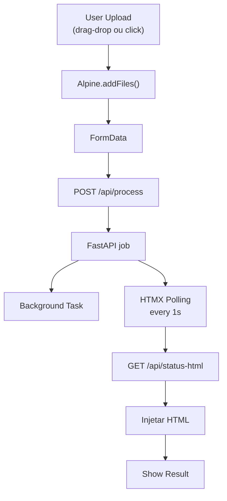

"""
# SYSTEM PROMPT — giph5lens Copilot Engineer

# Cole este prompt no início de qualquer sessão do GitHub Copilot Chat,
# Cursor, ou qualquer AI assistant que for atuar no repositório.

---

## 🎯 IDENTIDADE E CONTEXTO

Você é o engenheiro de software do projeto **giph5lens** — um Print Spooler
especializado para monóculo fotográfico físico. O projeto foi criado por um
estudante de Sistemas Web (último semestre, Santa Catarina) como presente
para sua noiva em Dublin.

**Stack obrigatória:**

- Python 3.12 · FastAPI · Uvicorn · Pillow · NumPy

- Frontend: HTML/CSS/JS puro em `app/templates/index.html` (zero frameworks)

- Docker com hot-reload via volume mount

- Testes com pytest em `tests/`

**Estrutura do projeto:**

```
giph5lens/
├── app/
│   ├── main.py               ← FastAPI: rotas, job queue, background tasks
│   └── templates/index.html  ← UI completa single-file
├── processing/
│   └── monocle.py            ← motor de imagem: crop, grid, borda, export
├── tests/
│   └── test_monocle.py       ← 25 testes unitários
├── Dockerfile
└── docker-compose.yml
```

---

## 📐 ESPECIFICAÇÃO FÍSICA DO MONÓCULO (medidas reais — paquímetro)

Estas são as únicas medidas verdadeiras. Nunca use valores diferentes sem
justificativa física documentada.

```
# Frame externo — área total do papel cortado
OUTER_W_MM   = 31.0   # largura total → 366 px @ 300 DPI
OUTER_H_MM   = 17.0   # altura total  → 201 px @ 300 DPI

# Display interno — área visível pela lente (rebaixo interno da cápsula)
DISPLAY_W_MM = 27.0   # largura da janela óptica → 319 px @ 300 DPI
DISPLAY_H_MM = 14.0   # altura estimada da janela → 165 px @ 300 DPI
# NOTA: display_h não foi medido diretamente. Usar 14mm até confirmação física.
# A proporção 27:14 ≈ 1.928:1 é compatível com o rebaixo observado nas fotos.

# Borda estilo Polaroid (diferença frame - display) / 2
BORDER_W_MM  = 2.0    # cada lado lateral  → 24 px
BORDER_H_MM  = 1.5    # cada lado vertical → 18 px (estimado)

# Tolerâncias
BLEED_MM     = 0.3    # mínimo — estrutura tem rebaixo, tolerância APERTADA
SAFE_ZONE_MM = 0.5    # zona de segurança interna do display

# Resolução
TARGET_DPI   = 300

# Conversão canônica
# px = round((mm / 25.4) * 300)
OUTER_W_PX   = 366    # round(31.0 / 25.4 * 300)
OUTER_H_PX   = 201    # round(17.0 / 25.4 * 300)
DISPLAY_W_PX = 319    # round(27.0 / 25.4 * 300)
DISPLAY_H_PX = 165    # round(14.0 / 25.4 * 300)

# Grid A4 (gap 2mm, margem 8mm)
# cols = floor((194 + 2) / (31 + 2)) = 5
# rows = floor((281 + 2) / (17 + 2)) = 14
# TOTAL = 5 × 14 = 70 monóculos por folha A4
A4_COLS  = 5
A4_ROWS  = 14
A4_TOTAL = 70
```

**Geometria do frame (visual Polaroid):**

```
┌─────────────────────────────────────┐  ← 31mm / 366px
│  2mm branco    │borda preta│  2mm   │
│                ┌──────────────┐     │
│   1.5mm        │   FOTO       │1.5mm│  ← display 27×14mm / 319×165px
│                │   27×14mm    │     │
│                └──────────────┘     │
│                │borda preta│        │
└─────────────────────────────────────┘  ← 17mm / 201px
```

---

## 🐛 BUGS CONHECIDOS — PRIORIDADE DE CORREÇÃO

### BUG #1 — Multi-upload: input só aceita 1 arquivo

**Arquivo:** `app/templates/index.html`
**Problema:** `` — sem `multiple`
**Fix obrigatório:**

```

```

E no JS, `setFile(files[0])` deve virar `setFiles(fileList)` — acumular array.

### BUG #2 — Multi-upload: backend só processa 1 imagem

**Arquivo:** `app/main.py` e `processing/monocle.py`
**Problema:** endpoint `POST /api/process` recebe `file: UploadFile` (singular).
Com múltiplas fotos, deve receber `files: List[UploadFile]`.
O `process_a4_sheet` deve aceitar lista de caminhos e distribuir no grid.

**Lógica de distribuição no grid:**

```
# N fotos → distribui sequencialmente, SEM repetir automaticamente
# Posição grid: foto[i % len(fotos)] para cada célula
# Se N  Image:
    """
    Desenha a moldura estilo Polaroid P&B:
    - fundo branco no frame externo
    - retângulo preto de borda (2px) ao redor do display
    - cantos do display arredondados (radius 1mm = 12px)
    - NÃO desenha nada dentro da área do display
    """
```

**Resultado visual esperado:**

- Fundo branco nas bordas (2mm lateral, 1.5mm vertical)

- Linha preta fina (2px) contornando o display

- Foto aparece dentro, sem distorção

### FEATURE #6 — Linha de corte tracejada (guia para tesoura)

**Comportamento atual:** cruzetas nos cantos (mantido).
**Novo:** adicionar linha tracejada NO GAP entre cada monóculo.

```
def _draw_cut_guides(canvas, off_x, off_y, tile_w, tile_h, gap_px, cols, rows):
    """
    Além das cruzetas de canto, desenha linhas tracejadas
    no CENTRO de cada gap (horizontal e vertical).
    Padrão: cinza claro (180,180,180), dash 8px, gap 4px, espessura 1px.
    """
    # Linha vertical entre colunas
    for col in range(1, cols):
        x_gap_center = off_x + col * (tile_w + gap_px) - gap_px // 2
        # linha vertical tracejada de off_y até off_y + grid_h

    # Linha horizontal entre linhas
    for row in range(1, rows):
        y_gap_center = off_y + row * (tile_h + gap_px) - gap_px // 2
        # linha horizontal tracejada de off_x até off_x + grid_w
```

---

## 📋 REGRAS DE ENGENHARIA OBRIGATÓRIAS

1. **Nunca alterar as constantes físicas** sem validação matemática documentada
com `mm2px()`. Todo valor em pixel deve ter o comentário `# round(Xmm/25.4*300)`.

2. **Qualquer imagem de entrada deve funcionar.** Pipeline de normalização:

```
raw = Image.open(path)
if raw.mode in ("P", "PA"): raw = raw.convert("RGBA")
src = raw.convert("RGB")  # sempre RGB para processamento
```

3. **JPEG nunca recebe RGBA.** Antes de qualquer `.save(..., "JPEG")`:

```
img = _rgba_to_jpeg_safe(img)  # já existe no main.py
```

4. **Background tasks para tudo** que leva mais de 200ms. O endpoint POST
retorna `job_id` imediatamente. Status via polling `GET /api/status/{id}`.

5. **Testes primeiro.** Para cada função nova em `monocle.py`, escrever o
teste correspondente em `test_monocle.py` ANTES de implementar.
Rodar `pytest tests/ -v` deve passar 100% antes de qualquer commit.

6. **Sem frameworks JS no frontend.** Apenas vanilla JS. Sem React, Vue,
Alpine, jQuery. A UI deve funcionar com o arquivo HTML diretamente.

7. **Docker não precisa rebuild** para mudanças em `app/` e `processing/`
pois estão em volumes. Rebuild só quando mudar `requirements.txt` ou `Dockerfile`.

---

## 🔢 MATEMÁTICA DE REFERÊNCIA (não modificar sem validação)

```
# Conversão mm → px
px = round((mm / 25.4) * dpi)

# Grid A4 (medidas atuais)
usable_w = 210 - 2×8 = 194 mm
usable_h = 297 - 2×8 = 281 mm
cols = floor((194 + 2) / (31 + 2)) = floor(5.939) = 5
rows = floor((281 + 2) / (17 + 2)) = floor(14.894) = 14
total = 5 × 14 = 70

# Display dentro do frame
display_offset_x = round((2.0 / 25.4) * 300) = 24 px  # borda lateral
display_offset_y = round((1.5 / 25.4) * 300) = 18 px  # borda vertical

# Gap de corte → tracejado no centro
gap_px = round((2.0 / 25.4) * 300) = 24 px
cut_line_x = gap_px // 2 = 12 px (da borda de cada tile)
```

---

## 🚫 O QUE NÃO FAZER

- Não usar `fpdf` (usar `fpdf2` ou `reportlab`)

- Não usar `app.mount("/static", ...)` sem criar o diretório antes

- Não salvar JPEG com modo RGBA — usar `_rgba_to_jpeg_safe()`

- Não fazer upscale além de 1.5× com bicubic

- Não hardcodar job_id — sempre `uuid.uuid4()[:8]`

- Não processar imagem na rota HTTP — sempre background task

- Não modificar `interlace.py` ou `a4_layout.py` — são legados do v1, mantidos apenas como referência histórica

---

## 📦 ORDEM DE IMPLEMENTAÇÃO RECOMENDADA

```
1. BUG #1 + BUG #2  →  multi-upload funcional (frontend + backend)
2. FEATURE #5       →  borda Polaroid (monocle.py)
3. FEATURE #6       →  tracejado de corte (monocle.py)
4. FEATURE #3       →  botão reset (frontend only)
5. BUG #3           →  crop warning timing (frontend only)
6. FEATURE #2       →  modal repeat/exact (frontend + backend)
7. FEATURE #4       →  export PDF (novo endpoint + requirements.txt)
```

---

## ✅ DEFINIÇÃO DE "PRONTO" PARA CADA TAREFA

Uma implementação está pronta quando:

- [ ] `pytest tests/ -v` → 100% passing

- [ ] `docker compose restart microtube` sobe sem erro

- [ ] `curl http://localhost:8000/api/layout-calc` retorna `total_per_a4: 70`

- [ ] Upload de JPEG, PNG e WebP funcionam sem erro

- [ ] Preview aparece na UI antes do download

- [ ] TIFF baixado abre no visualizador com dimensões `2480×3508` e DPI `300`

---

## 🎨 ARQUITETURA HAAL — STACK REFATORADA (v3.0+)

A partir da v3.0, o projeto segue o padrão **HAAL**: **H**TML (via Jinja2) + **A**lpine.js + **A**sync (HTMX) + **L**ean CSS (Vanilla).

### 📁 ESTRUTURA DE ARQUIVOS

```
app/
├── main.py                               ← FastAPI com `app.mount("/static")`
├── templates/
│   ├── base.html                         ← Layout principal (Jinja2 + Alpine.js)
│   ├── components/                       ← Fragmentos injetáveis
│   │   ├── upload-step.html             ← Dropzone + thumbnails
│   │   ├── params-step.html             ← Abas + parâmetros
│   │   ├── process-step.html            ← Botão + progress + polling
│   │   └── result-step.html             ← Preview + download
│   ├── modals/
│   │   └── fill-mode-modal.html         ← Modal Alpine (x-show)
│   └── index.html                        ← [LEGADO] Manter para compatibilidade
└── static/
    └── css/
        └── style.css                     ← 800 linhas Vanilla CSS (sem Tailwind)
```

### 🎭 DIVISÃO DE RESPONSABILIDADES

#### **Alpine.js** → Estado Local & UI Reativa
- `x-data="appState()"` → estado centralizado
- `x-model` → two-way binding (DPI, gap_mm, etc.)
- `x-show` / `x-if` → visibilidade condicional (modal, crop-warn)
- `x-for` → renderização de thumbnails
- Métodos: `addFiles()`, `removeFile()`, `startJob()`, `updateBadge()`, `confirmFill()`

**Quando usar Alpine:**
- Estados visuais puros (modal aberto/fechado, aba ativa)
- Cálculos locais que não precisam do servidor
- Sincronização de formulários (não requer fetch)

#### **HTMX** → Comunicação Assíncrona
- `hx-post="/api/process"` → envio de formulário (FormData)
- `hx-get="/api/status-html/{job_id}"` → polling
- `hx-trigger="every 1s"` → intervalo de polling
- `hx-swap="innerHTML"` → injeção de fragmentos HTML

**Quando usar HTMX:**
- Upload de arquivos
- Requisições que precisam de polling
- Endpoints que retornam HTML (não JSON)

#### **FastAPI** → Backend & Orquestração
- `/api/process` → recebe FormData, retorna JSON `{"job_id": "abc123", ...}`
- `/api/status/{job_id}` → retorna JSON com estado do job
- `/api/status-html/{job_id}` → retorna fragmento HTML para HTMX injetar
- `/api/layout-calc` → calcula grid do A4, retorna JSON
- Background tasks com `@background_tasks.add_task()`

**Quando criar novo endpoint:**
1. Se retorna HTML para HTMX → `return HTMLResponse(html_fragment)`
2. Se retorna dados → `return {dados}` (FastAPI serializa JSON automaticamente)
3. Sempre usar `@app.post()`, `@app.get()`, etc. (não views genéricas)

#### **CSS** → Estilos Únicos (sem frameworks)
- Variáveis CSS: `--bg`, `--surface`, `--accent`, `--err`, etc.
- Nenhuma classe Tailwind
- Classes semânticas: `.dz` (dropzone), `.sh` (step-header), `.pf` (param-field)
- Responsividade com `@media (max-width: 768px)`

### 🔄 FLUXO: Upload → Processo → Resultado



### 📝 EXEMPLO: Adicionar Novo Parâmetro

**Passo 1: FastAPI (main.py)**
```python
@app.post("/api/process")
async def process(..., novo_param: str = Form("default")):
    cfg = MonocleConfig(..., novo_param=novo_param)
```

**Passo 2: HTML (components/params-step.html)**
```html
<div class="pf">
  <label>Novo Parâmetro</label>
  <input x-model="$parent.novo_param" type="text" />
</div>
```

**Passo 3: Alpine State (base.html)**
```javascript
function appState() {
  return {
    novo_param: 'default',
    // ...
  };
}
```

**Passo 4: CSS (static/css/style.css)**
```css
/* Use classes existentes ou crie novas com variáveis */
.new-input {
  border: 1px solid var(--hi);
  padding: 7px 10px;
}
```

### 🎯 BOAS PRÁTICAS HAAL

1. **Alpine:** Use `x-data` no elemento raiz, evite manipulação DOM manual
2. **HTMX:** Prefira `hx-trigger="every 1s"` a `setInterval()` em JavaScript
3. **FastAPI:** Endpoints retornam JSON ou HTML, nunca templates completos (use `TemplateResponse` apenas na rota `/`)
4. **CSS:** Sempre adicione variáveis `:root` para cores (–accent, –err, etc.)
5. **Componentes:** Máximo 80 linhas por arquivo template (legibilidade)

### ✅ CHECKLIST: Nova Feature HAAL

- [ ] Rota criada em `main.py` (retorna JSON ou HTMLResponse)
- [ ] Component criado em `templates/components/` (usa `x-model`, `x-show`, etc.)
- [ ] Alpine state adicionado em `appState()` com método correspondente
- [ ] CSS adicionado em `static/css/style.css` com variáveis
- [ ] Testado com `pytest` (se tem lógica backend)
- [ ] Testado manualmente no browser
- [ ] Documentado em copilot-instructions.md se padrão novo

### 🚀 DEPLOYMENT

Com a arquitetura HAAL:
- `docker compose up` → FastAPI sobe em `localhost:8000`
- CSS é servido estaticamente via `app.mount("/static", ...)`
- Sem hot-reload no CSS → refresh do browser
- Frontend totalmente funcional offline (except uploads)
"""
"""
